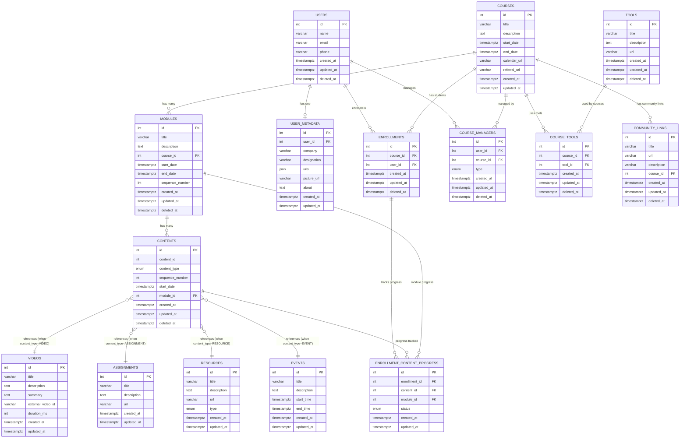

# 🎯 **CLUG Service - Entity Relationship Diagram (ERD)**

---

## 📊 **Visual ERD Representation**



## 🔗 **Relationship Details**

### **One-to-Many Relationships**
| Parent | Child | Relationship | Foreign Key | Delete Action |
|--------|-------|--------------|-------------|---------------|
| `courses` | `modules` | 1:N | `course_id` | RESTRICT |
| `modules` | `contents` | 1:N | `module_id` | RESTRICT |
| `users` | `user_metadata` | 1:1 | `user_id` | CASCADE |
| `users` | `enrollments` | 1:N | `user_id` | RESTRICT |
| `courses` | `enrollments` | 1:N | `course_id` | RESTRICT |
| `enrollments` | `enrollment_content_progress` | 1:N | `enrollment_id` | CASCADE |
| `contents` | `enrollment_content_progress` | 1:N | `content_id` | CASCADE |
| `modules` | `enrollment_content_progress` | 1:N | `module_id` | CASCADE |
| `users` | `course_managers` | 1:N | `user_id` | RESTRICT |
| `courses` | `course_managers` | 1:N | `course_id` | RESTRICT |
| `courses` | `course_tools` | 1:N | `course_id` | CASCADE |
| `tools` | `course_tools` | 1:N | `tool_id` | CASCADE |
| `courses` | `community_links` | 1:N | `course_id` | CASCADE |

### **Polymorphic Relationships**
| Table | References | Condition |
|-------|------------|-----------|
| `contents` | `videos` | `content_type = 'VIDEO'` |
| `contents` | `assignments` | `content_type = 'ASSIGNMENT'` |
| `contents` | `resources` | `content_type = 'RESOURCE'` |
| `contents` | `events` | `content_type = 'EVENT'` |

### **Many-to-Many Relationships**
| Entity A | Entity B | Junction Table | Description |
|----------|----------|----------------|-------------|
| `users` | `courses` | `enrollments` | Student enrollments |
| `users` | `courses` | `course_managers` | Staff assignments |
| `courses` | `tools` | `course_tools` | Course development tools |

---

## 📋 **Table Specifications**

### **Primary Keys**
All tables use auto-incrementing integer primary keys (`id`)

### **Foreign Keys with Constraints**
```sql
-- Module belongs to Course
ALTER TABLE modules 
ADD CONSTRAINT fk_modules_course 
FOREIGN KEY (course_id) REFERENCES courses(id) ON DELETE RESTRICT;

-- Content belongs to Module
ALTER TABLE contents 
ADD CONSTRAINT fk_contents_module 
FOREIGN KEY (module_id) REFERENCES modules(id) ON DELETE RESTRICT;

-- User Metadata belongs to User (One-to-One)
ALTER TABLE user_metadata 
ADD CONSTRAINT fk_user_metadata_user 
FOREIGN KEY (user_id) REFERENCES users(id) ON DELETE CASCADE;

-- Enrollment relationships
ALTER TABLE enrollments 
ADD CONSTRAINT fk_enrollments_user 
FOREIGN KEY (user_id) REFERENCES users(id) ON DELETE RESTRICT;

ALTER TABLE enrollments 
ADD CONSTRAINT fk_enrollments_course 
FOREIGN KEY (course_id) REFERENCES courses(id) ON DELETE RESTRICT;

-- Enrollment Content Progress relationships
ALTER TABLE enrollment_content_progress 
ADD CONSTRAINT fk_enrollment_content_progress_enrollment 
FOREIGN KEY (enrollment_id) REFERENCES enrollments(id) ON DELETE CASCADE;

ALTER TABLE enrollment_content_progress 
ADD CONSTRAINT fk_enrollment_content_progress_content 
FOREIGN KEY (content_id) REFERENCES contents(id) ON DELETE CASCADE;

ALTER TABLE enrollment_content_progress 
ADD CONSTRAINT fk_enrollment_content_progress_module 
FOREIGN KEY (module_id) REFERENCES modules(id) ON DELETE CASCADE;

-- Course Manager relationships
ALTER TABLE course_managers 
ADD CONSTRAINT fk_course_managers_user 
FOREIGN KEY (user_id) REFERENCES users(id) ON DELETE RESTRICT;

ALTER TABLE course_managers 
ADD CONSTRAINT fk_course_managers_course 
FOREIGN KEY (course_id) REFERENCES courses(id) ON DELETE RESTRICT;

-- Course Tools relationships
ALTER TABLE course_tools 
ADD CONSTRAINT fk_course_tools_course 
FOREIGN KEY (course_id) REFERENCES courses(id) ON DELETE CASCADE;

ALTER TABLE course_tools 
ADD CONSTRAINT fk_course_tools_tool 
FOREIGN KEY (tool_id) REFERENCES tools(id) ON DELETE CASCADE;

-- Community Links relationships
ALTER TABLE community_links 
ADD CONSTRAINT fk_community_links_course 
FOREIGN KEY (course_id) REFERENCES courses(id) ON DELETE CASCADE;
```

### **Unique Constraints**
```sql
-- Prevent duplicate enrollments
ALTER TABLE enrollments 
ADD CONSTRAINT unique_user_course_enrollment 
UNIQUE (course_id, user_id);

-- Prevent duplicate course management assignments
ALTER TABLE course_managers 
ADD CONSTRAINT unique_user_course_management 
UNIQUE (user_id, course_id);

-- Ensure unique contact information
ALTER TABLE users 
ADD CONSTRAINT unique_user_contact 
UNIQUE (email, phone);

-- Ensure sequence uniqueness within scope
ALTER TABLE modules 
ADD CONSTRAINT unique_module_sequence_per_course 
UNIQUE (course_id, sequence_number);

ALTER TABLE contents 
ADD CONSTRAINT unique_content_sequence_per_module 
UNIQUE (module_id, sequence_number);

-- One metadata record per user
ALTER TABLE user_metadata 
ADD CONSTRAINT unique_user_metadata 
UNIQUE (user_id);

-- Prevent duplicate course-tool associations
ALTER TABLE course_tools 
ADD CONSTRAINT unique_course_tool 
UNIQUE (course_id, tool_id);

-- Prevent duplicate progress records for same enrollment and content
ALTER TABLE enrollment_content_progress 
ADD CONSTRAINT unique_enrollment_content 
UNIQUE (enrollment_id, content_id);
```

### **Enum Types**
```sql
-- Content type enumeration
CREATE TYPE content_type_enum AS ENUM (
    'VIDEO', 
    'RESOURCE', 
    'ASSIGNMENT', 
    'EVENT'
);

-- Resource type enumeration  
CREATE TYPE resource_type_enum AS ENUM (
    'PDF', 
    'IMAGE', 
    'URL', 
    'TEXT'
);

-- Manager type enumeration
CREATE TYPE manager_type_enum AS ENUM (
    'COURSE_MANAGER', 
    'INSTRUCTOR'
);

-- Progress status enumeration
CREATE TYPE progress_status_enum AS ENUM (
    'NOT_STARTED', 
    'IN_PROGRESS', 
    'COMPLETED'
);
```

---

## 🎯 **Key Design Patterns**

### **1. Polymorphic Content System**
```
contents table acts as a junction with polymorphic references:
┌─────────────┐    ┌──────────────┐
│   contents  │    │    videos    │
│             │────│              │
│ content_id  │    │      id      │
│content_type │    └──────────────┘
└─────────────┘    ┌──────────────┐
                   │ assignments  │
                   │              │
                   │      id      │
                   └──────────────┘
```

### **2. Soft Delete Pattern**
Tables with `deleted_at` field:
- ✅ `modules`
- ✅ `contents`  
- ✅ `users`
- ✅ `enrollments`
- ✅ `course_managers`
- ✅ `tools`
- ✅ `course_tools`
- ✅ `community_links`

### **3. Sequence Management**
Ordered content delivery:
```
Course 1
├── Module 1 (sequence: 1)
│   ├── Video 1 (sequence: 1)
│   ├── Assignment 1 (sequence: 2)
│   └── Resource 1 (sequence: 3)
├── Module 2 (sequence: 2)
│   ├── Video 2 (sequence: 1)
│   └── Event 1 (sequence: 2)
```

### **4. User Role Management**
```
User ──┬── Student (via enrollments)
       └── Staff (via course_managers)
           ├── COURSE_MANAGER
           └── INSTRUCTOR
```

### **5. Progress Tracking System**
```
Enrollment ──┬── EnrollmentContentProgress (for each content)
             │   ├── enrollment_id (FK)
             │   ├── content_id (FK)
             │   ├── module_id (FK)
             │   └── status (NOT_STARTED | IN_PROGRESS | COMPLETED)
             │
             └── Tracks progress for each piece of content
                 across modules in an enrolled course
```

---

## 🔍 **Query Patterns**

### **Get User's Enrolled Courses**
```sql
SELECT c.*, e.created_at as enrolled_at
FROM courses c
JOIN enrollments e ON c.id = e.course_id
JOIN users u ON e.user_id = u.id
WHERE u.email = 'user@example.com'
AND e.deleted_at IS NULL;
```

### **Get Course Content Structure**
```sql
SELECT 
    c.title as course_title,
    m.title as module_title,
    m.sequence_number as module_order,
    co.content_type,
    co.sequence_number as content_order
FROM courses c
JOIN modules m ON c.id = m.course_id
JOIN contents co ON m.id = co.module_id
WHERE c.id = 1
AND m.deleted_at IS NULL
AND co.deleted_at IS NULL
ORDER BY m.sequence_number, co.sequence_number;
```

### **Get Course Staff**
```sql
SELECT 
    u.name,
    u.email,
    cm.type as role
FROM users u
JOIN course_managers cm ON u.id = cm.user_id
WHERE cm.course_id = 1
AND u.deleted_at IS NULL
AND cm.deleted_at IS NULL;
```

### **Get User's Course Progress**
```sql
SELECT 
    m.title as module_title,
    c.content_type,
    ecp.status,
    ecp.updated_at as last_activity
FROM enrollments e
JOIN enrollment_content_progress ecp ON e.id = ecp.enrollment_id
JOIN contents c ON ecp.content_id = c.id
JOIN modules m ON ecp.module_id = m.id
WHERE e.user_id = 1
AND e.course_id = 1
ORDER BY m.sequence_number, c.sequence_number;
```

### **Calculate Course Completion Percentage**
```sql
SELECT 
    COUNT(*) FILTER (WHERE ecp.status = 'COMPLETED') * 100.0 / COUNT(*) as completion_percentage
FROM enrollments e
JOIN enrollment_content_progress ecp ON e.id = ecp.enrollment_id
WHERE e.user_id = 1
AND e.course_id = 1;
```

---

## 📈 **Scalability Features**

### **Indexing Strategy**
```sql
-- Performance indexes
CREATE INDEX idx_users_email ON users(email);
CREATE INDEX idx_enrollments_user_id ON enrollments(user_id);
CREATE INDEX idx_enrollments_course_id ON enrollments(course_id);
CREATE INDEX idx_modules_course_id ON modules(course_id);
CREATE INDEX idx_modules_course_sequence ON modules(course_id, sequence_number);
CREATE INDEX idx_modules_start_date ON modules(start_date);
CREATE INDEX idx_contents_module_id ON contents(module_id);
CREATE INDEX idx_contents_module_sequence ON contents(module_id, sequence_number);
CREATE INDEX idx_contents_polymorphic ON contents(content_type, content_id);
CREATE INDEX idx_contents_start_date ON contents(start_date);
CREATE INDEX idx_contents_type ON contents(content_type);
CREATE INDEX idx_enrollment_content_progress_enrollment ON enrollment_content_progress(enrollment_id);
CREATE INDEX idx_enrollment_content_progress_content ON enrollment_content_progress(content_id);
CREATE INDEX idx_enrollment_content_progress_module ON enrollment_content_progress(module_id);
CREATE INDEX idx_enrollment_content_progress_status ON enrollment_content_progress(status);
CREATE INDEX idx_course_managers_course_id ON course_managers(course_id);
CREATE INDEX idx_course_tools_course_id ON course_tools(course_id);
CREATE INDEX idx_course_tools_tool_id ON course_tools(tool_id);
CREATE INDEX idx_community_links_course_id ON community_links(course_id);
CREATE INDEX idx_resources_type ON resources(type);
CREATE INDEX idx_resources_id_type_title ON resources(id, type, title);
CREATE INDEX idx_videos_external_id ON videos(external_video_id);
CREATE INDEX idx_events_time_range ON events(start_time, end_time);
CREATE INDEX idx_events_start_time ON events(start_time);
```

### **Data Integrity**
- Foreign key constraints prevent orphaned records
- Unique constraints prevent duplicate relationships
- Check constraints ensure data validity
- Enum types ensure consistent values

### **Flexibility**
- JSON fields for extensible metadata
- Polymorphic content system for multiple media types
- Soft deletes for data recovery
- Timestamp fields for audit trails
- Progress tracking system for personalized learning paths

---

## 🎓 **Key Features Supported**

1. **Course Management** - Complete curriculum structure with modules and ordered content
2. **Content Polymorphism** - Support for videos, assignments, resources, and events
3. **User Management** - Students, instructors, and course managers with role-based access
4. **Progress Tracking** - Track individual student progress through course content
5. **Tool Integration** - Link external tools and resources to courses
6. **Community Features** - Community links for collaboration and discussion
7. **Flexible Scheduling** - Start and end dates at course, module, and content levels
8. **Soft Deletes** - Data recovery and audit capabilities
9. **Performance Optimized** - Comprehensive indexing for fast queries

---

This ERD represents a robust, scalable Learning Management System database designed to handle course delivery, user management, content organization, and progress tracking efficiently! 🚀
